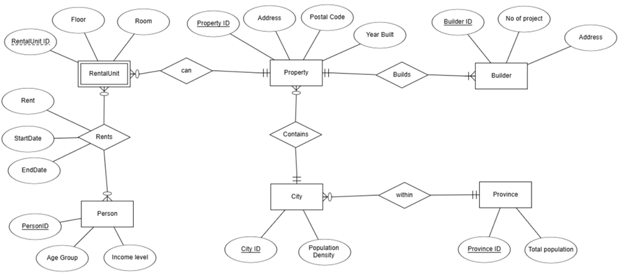
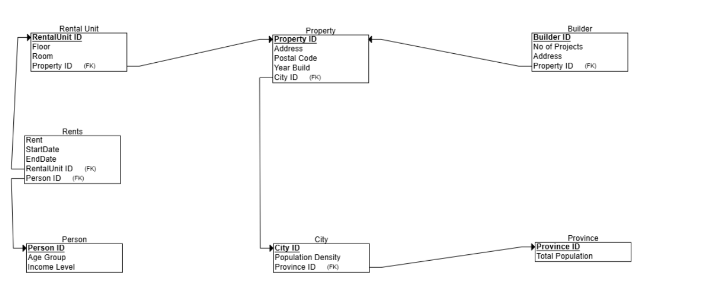

# REGIONAL HOUSING CRISIS

## Problem Statement
A regional housing crisis signifies a severe imbalance between the demand for and supply of suitable, affordable housing. This imbalance manifests in several critical issues: 

•	Housing Affordability: A significant portion of the population faces housing costs exceeding 30% of their income, leaving them "cost-burdened" and vulnerable to housing instability. 

•	Housing Availability: A shortage of available units across all housing types (rental, ownership) exacerbates competition, driving prices higher and limiting choices for individuals and families.

•	Homelessness: The lack of affordable housing contributes to increased homelessness, impacting individuals and families experiencing poverty, mental health challenges, and other vulnerabilities. 

•	Community Impacts: The crisis can lead to social and economic strain, hindering community growth, attracting and retaining a skilled workforce, and impacting overall quality of life.

## Scope Definition 
This analysis will focus on understanding the multifaceted nature of the regional housing crisis within 
a specific geographic area. The scope will encompass: 

• Identification of Key Stakeholders: This includes homeowners, renters, landlords, 
developers, government agencies (municipal, provincial, federal), non-profit organizations, 
community groups, and businesses. 

• Data Collection and Analysis: Gathering and analysing quantitative and qualitative data on 
housing costs, availability, demographics, economic conditions, and other relevant factors. 

• Development of an Entity-Relationship Diagram (ERD): Visualizing the complex 
interconnections between key entities involved in the housing market. 

• Identification of Potential Solutions: Exploring a range of potential policy interventions, 
community-based initiatives, and private sector solutions to address the housing crisis. 

# Entity diagram:

# Relational schema Diagram: 

# Source Code:

